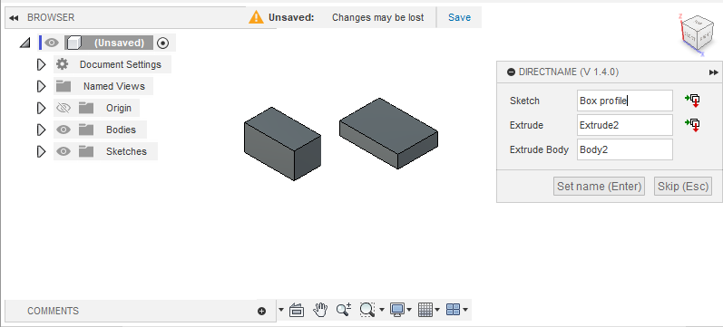

# DirectName

A Fusion 360 add-in for naming features directly after creation. After creating a feature (e.g. *Extrude*) a dialog prompts for its name.

## Installation
Download the add-in from the [Releases](https://github.com/thomasa88/DirectName/releases) page.

Unpack it into `API\AddIns` (see [How to install an add-in or script in Fusion 360](https://knowledge.autodesk.com/support/fusion-360/troubleshooting/caas/sfdcarticles/sfdcarticles/How-to-install-an-ADD-IN-and-Script-in-Fusion-360.html)).

Make sure the directory is named `DirectName`, with no suffix.

## Usage

Press Shift+S in Fusion 360 and go to the *Add-Ins* tab. Then select the add-in and click the *Run* button. Optionally select *Run on Startup*.

A naming dialog will be shown automatically when new features are created.

## Changelog

* v0.1.3
  * Change to MIT license, for app store compatibility