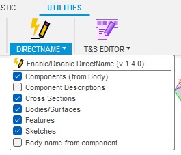

# DirectName

DirectName is an Autodesk® Fusion add-in for naming features and bodies directly after creation. After creating a feature (e.g. *Extrude*) a dialog prompts for names for the feature and any created bodies.

## Supported Platforms

* Windows
* Mac OS

## Installation

The add-in can be downloaded directly from GitHub or installed using an installer created by Autodesk. Only use one of the installation methods at a time.

### From GitHub

Download the add-in from the [Releases](https://github.com/thomasa88/DirectName/releases) page.

Unpack it into `API\AddIns` (see [How to install an add-in or script in Fusion 360](https://knowledge.autodesk.com/support/fusion-360/troubleshooting/caas/sfdcarticles/sfdcarticles/How-to-install-an-ADD-IN-and-Script-in-Fusion-360.html)).

Make sure the directory is named `DirectName`, with no suffix.

### From Autodesk App store

Download the installer for your OS at https://apps.autodesk.com/FUSION/en/Detail/Index?id=7497198800232664541 .

## Usage

A naming dialog will be shown automatically when new features are created.

Press Tab to navigate the inputs and press Enter when done. Press Esc to skip naming.

Enable/disable the naming dialog by clicking on the *DIRECTNAME* button under the *TOOLS* tab.

The *DIRECTNAME* menu allows you to select what types of elements that will trigger the naming prompt.

The add-in can be disabled using the *Scripts and Add-ins* dialog. Press *Shift+S* in Fusion and go to the *Add-Ins* tab.

## Known Limitations

* Direct Edit mode is not supported.
* DirectName loses track of changes when switching documents while creating a feature.

## Reporting Issues

Please report any issues that you find on the [Issues](https://github.com/thomasa88/DirectName/issues) page.

For better support, please include the steps you performed and the result. Also include copies of any error messages.

## Author

This add-in is created by Thomas Axelsson.

## License

This project is licensed under the terms of the MIT license. See [LICENSE](LICENSE).

## Changelog

* v 1.4.0 (October 2024)
  * Fix lag when navigating in Fusion. #12
  * Auto-focus first text box (Windows only). #13
  * Button to copy name down to text boxes below.
  * Show dialog after creating a component as part of Extrude. #3
  * Fix syntax error in algorithm finding new bodies.
  * Option to inherit component name for new bodies. #10
* v 1.3.1 (June 2024)
  * Fix error pop-ups in Flat Pattern editor. #11
* v 1.3.0 (April 2023)
  * Options to only name certain types of elements.
* v 1.2.2
  * Remove highlighting of features, to fix "InternalValidationError : selecCmd" error.
* v 1.2.1
  * Fix "new body" heuristic to handle all Fusion 360™ languages.
* v 1.2.0
  * Enable/Disable button. Autodesk® store conformance.
* v 1.1.3
  * Enable *Run on Startup* by default.
* v 1.1.2
  * Highlight correct entity on mouse focus (Focusing by keyboard still only happens after text change ([Limitation](https://forums.autodesk.com/t5/fusion-360-api-and-scripts/event-when-commandinput-is-focused/m-p/9693906)).)
  * Name Section Analyses after creation.
  * Fix error when closing documents and exiting Fusion 360™.
* v 1.1.1
  * Handle objects that are not selectable, due to Fusion 360™ [API limitations](https://forums.autodesk.com/t5/fusion-360-api-and-scripts/api-bug-cannot-access-entity-of-quot-move-quot-feature/m-p/9651921).
* v 1.1.0
  * Fix highlighting of bodies that are part of components.
* v 1.0.1
  * Pen logo
  * Autodesk® store conformance.
* v 1.0.0
  * New logo
* v 0.2.0
  * Rename new bodies and surfaces
  * Highlight active entity when name is edited
* v 0.1.3
  * Change to MIT license, for app store compatibility